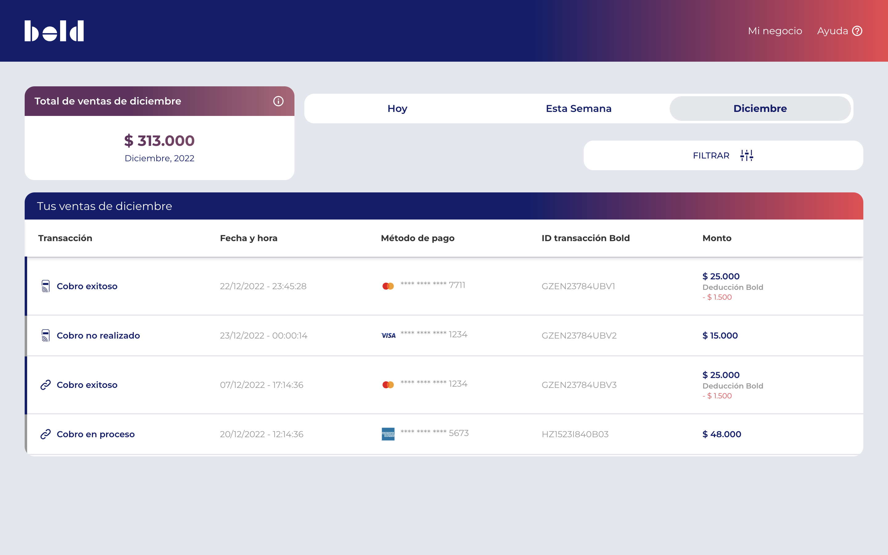
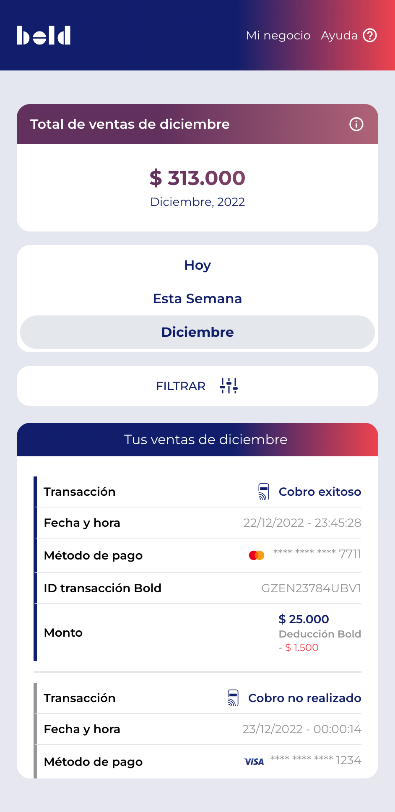

# Payments History App

This project is part of a technical test for [Bold company](https://bold.co/).

## Description
The app is a dashboard that displays payment history information, including an overview summary and a table with detailed data for each payment. The user is able to interact with the data through some tabs that allow the filter by a period in time (current day, week, or month) and by a specific payment method.

## Demo Link

Deployment of the web app on Vercel:

[payments-history.vercel.app](https://payments-history.vercel.app/)

## Screenshots

## Tasks breakdown

To check the tasks breakdown, please refer to the GitHub Project [Billing History](https://github.com/GersonJairG/billing-history)

## Technologies Used

- TypeScript
- React
- TailwindCSS
- Jest
- ReactTestingLibrary
- Cypress

## Deployment tool

- Vercel

## Setup
- Download or clone the repository
- Run `npm install`
### Run Project
- Run `npm start`
- Open `http://localhost:3000` to view it in your browser.

### Run Unit tests
- Run `npm run test:units`
- Verify all tests pass.

### Run e2e tests
- Run `npm start` (IMPORTANT)
- Run `npm run test:e2e`
- In the Cypress dashboard select 'E2E Testing'(Already Configured)
- Choose a browser and select the test file payments.cy.ts
- Verify all tests pass.
